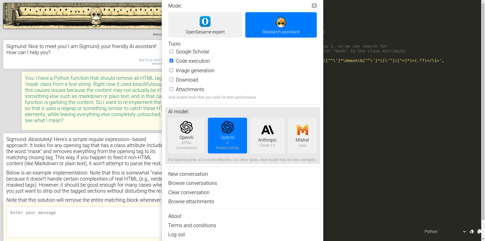

# Sigmund AI

Copyright 2023-2025 Sebastiaan Mathôt


A Python library and web app for an LLM-based chatbot with two main modes:

- __OpenSesame expert__: answers questions about OpenSesame based on documentation
- __Research assistant__: a general purpose chatbot with several tools that are mainly useful for research

Features:

- __Privacy__: all messages and uploaded attachments are encrypted so that no-one can listen in on your conversation
- __Knowledge__ (in OpenSesame mode): access to documentation 
- __Continuous conversation__: conversations are summarized w hen they become too long to fit into the prompt
- __Tool use__ (in research-assistant mode):
    - __Code execution__: ability to execute Python and R code
    - __Google Scholar search__: ability to search for articles on Google Scholar
    - __Image generation__: ability to generate images
    
Sigmund is not a large language model itself. Rather it uses third-party models. Currently, models from [OpenAI](https://openai.com), [Anthropic](https://www.anthropic.com/), and [Mistral](https://mistral.ai/) are supported. API keys from these respective providers are required.




## What can Sigmund do? And how does Sigmund work?

For a description of how Sigmund works, see: <https://sigmundai.eu/about>. This page describes the default configuration.


## Configuration

See `sigmund/config.py` for configuration instructions.


## Dependencies

For Python dependencies, see `pyproject.toml`. In addition to these, `pandoc` is required for the ability to read attachments, and a local `redis` server needs to run for persistent data between sessions.


## Running (development)

Download the source code, and in the folder of the source code execute the following:

```
# Specify API keys for model providers. Even when using Anthropic (Claude) or
# Mistral, an OpenAI key is provided when document search is enabled
export OPENAI_API_KEY="your key here"
export ANTHROPIC_API_KEY="your key here"
export MISTRAL_API_KEY="your key here"
pip install .               # install dependencies
python index_library.py     # build library (documentation) index
python app.py               # start the app
```

Next, access the app (by default) through:

```
http://127.0.0.1:5000/
```


## Running (production)

In production, the server is generally not run by directly calling the app. There are many ways to run a Flask app in production. One way is to use gunicorn to start the app, and then use an nginx web server as a proxy that reroutes requests to the app. When taking this route, make sure to set up nginx with a large `client_max_body_size` (to allow attachment uploading) and disable `proxy_cache` and `proxy_buffering` (to allow status messages to be streamed while Sigmund is answering).


## License

Sigmund is distributed under the terms of the GNU General Public License 3. The full license should be included in the file `COPYING`, or can be obtained from:

- <http://www.gnu.org/licenses/gpl.txt>
